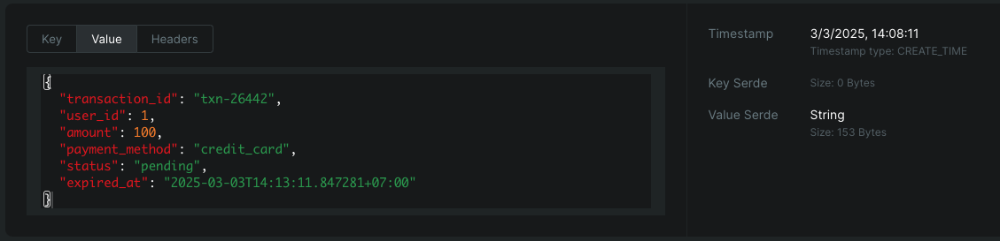

# Project Wallet top-up

## Overview

This project is a modern development framework designed to integrate multiple services using a Docker-based architecture. It leverages containerized environments to ensure seamless deployment, scalability, and efficient management of infrastructure dependencies.

The architecture includes widely-used services like PostgreSQL for relational database management, Kafka for event-driven messaging, OpenSearch for real-time data analytics and search, Redis for caching, MongoDB for NoSQL storage, and Graylog for centralized logging. All services communicate within a unified network to provide a complete solution for data-driven, fault-tolerant applications.

---

## Requirements

- **Docker**: Version 20.10 or later
- **Docker Compose**: Version 2.34 or later

---

## Services

### 1. **PostgreSQL**
- **Image**: `postgres:16`
- A reliable relational database for structured data management.
- **Ports**: `5432:5432`
- **Environment Variables**:
    - **POSTGRES_USER**: `user`
    - **POSTGRES_PASSWORD**: `password`
    - **POSTGRES_DB**: `mydb`

---

### 2. **Kafka**
- **Broker Image**: `bitnami/kafka:3.6.0`
- **Zookeeper Image**: `bitnami/zookeeper:3.8`
- Event-driven messaging platform to handle asynchronous communication between services.
- **Ports**:
    - Kafka Broker: `9092:9092`
    - Zookeeper: `2181:2181`
- Kafka topics can be managed in Kafka UI.

---

### 3. **Kafka UI**
- **Image**: `provectuslabs/kafka-ui:v0.7.1`
- A web interface for managing Kafka topics and monitoring broker activity.
- **Port**: `8082:8080`

---

### 4. **OpenSearch**
- **Image**: `opensearchproject/opensearch:2.12.0`
- A search and data analytics engine designed for log management and monitoring.
- **Port**: `9200:9200`
- **Key Features**: Pre-integrated with Graylog for real-time log analytics.

---

### 5. **MongoDB**
- **Image**: `mongo:6.0`
- A NoSQL database optimized for unstructured document storage.
- **Port**: `27017:27017`

---

### 6. **Graylog**
- **Image**: `graylog/graylog:5.2`
- A centralized log management solution integrated with OpenSearch and MongoDB.
- **Ports**:
    - Web UI: `9000:9000`
    - Syslog Input: `1514/udp`
    - GELF Input: `12201/udp`

---

### 7. **Redis**
- **Image**: `redis:6.2-alpine`
- In-memory data store used for caching and message queuing.
- **Port**: `6379:6379`

---

## Project Structure

```
Project Root
├── docker-compose.yml    # Docker Compose file defining the service architecture.
├── init.sql              # SQL file initialized into the PostgreSQL container.
└── volumes/              # Volume configurations for persistent storage.
    ├── postgres_data/    # PostgreSQL data directory.
    ├── mongodb_data/     # MongoDB data directory.
    └── redis_data/       # Redis data directory.
```

---

## Setup Instructions

### 1. Prerequisites
- Ensure **Docker** and **Docker Compose** are installed on your system.

### 2. Start the Services
Run the following command in the project root to start all services:

```shell script
docker compose up -d
```

The `-d` flag will run the services in detached mode.

### 3. Access Key Services
- **PostgreSQL**: `localhost:5432`
- **Kafka UI**: [http://localhost:8082](http://localhost:8082)
- **OpenSearch**: [http://localhost:9200](http://localhost:9200)
- **Graylog**: [http://localhost:9000](http://localhost:9000)  
  Default Credentials:
    - Username: `admin`
    - Password: `password`

---

## Stopping the Services

To stop all services, run:

```shell script
docker compose down
```

---

## Troubleshooting

### 1. Log Files
All service logs can be monitored using the `docker logs` command. For example, to view PostgreSQL logs:

```shell script
docker logs postgres
```

### 2. Services Not Starting
Ensure previous services are properly stopped before starting new instances:

```shell script
docker-compose down
docker-compose up -d
```

---

## API references

POST /wallet/verify

URL: http://localhost:8084/wallet/verify

request body:
```json
{
    "user_id": 1,
    "amount": 100.0,
    "payment_method": "credit_card"
}
```
response:
```json
{
    "transaction_id": "txn-57909",
    "user_id": 1,
    "amount": 100,
    "payment_method": "credit_card",
    "status": "pending",
    "balance": 0,
    "prev_transaction_id": 0,
    "prev_balance": 0,
    "expired_at": "2025-03-03T13:52:34.960077+07:00"
}
```
When user not found
```json
{
    "error": "User not found"
}
```
We can double-check on Kafka UI

---

## License

This project is distributed under the MIT License. See `LICENSE` for more details.

---


## Contact

For any inquiries or issues, please contact me at `duckdev84@gmail.com`.